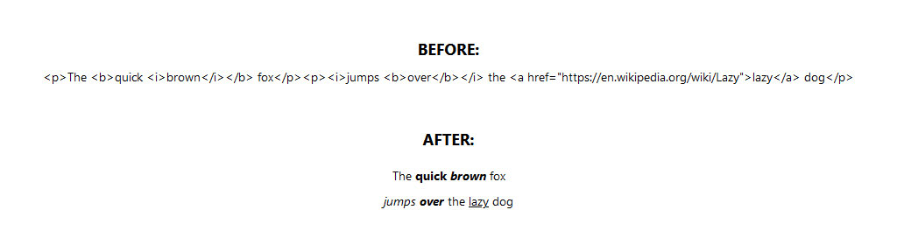

## ReactNative HTML Text
The ReactNative `Text` element does not support any HTML tags by default so formatting (e.g. paragraphs, italic and bold) used in standard HTML can be somewhat cumbersome to implement, or result in the need for separate 'documents' for App and Web implementations.  This simple `HtmlText` element is a drop-in replacement for the `Text` element but will parse a number of standard HTML tags.

### Example


### Installation
Add the following line to the `package.json` file in the ReactNative project directory, and run install on your package manager (e.g. `yarn install`).
```javascript
"react-native-htmltext": "https://github.com/anstokes/react-native-htmltext.git",
```

### Basic Usage
Import the element from `react-native-htmltext`, and use `HtmlText` instead of `Text`; for example:
```javascript
import React from 'react';
import HtmlText from 'react-native-htmltext';

const htmlString = '<p>The <b>quick <i>brown</i></b> fox</p><p><i>jumps <b>over</b></i> the <a href="https://en.wikipedia.org/wiki/Lazy">lazy</a>

export default function App() {
	return (
		<HtmlText>{htmlString}</HtmlText>
	);
}
```

### Advanced Usage
It is possible to override both the default styling for each tag type and/or override the base element used to render the paragraphs and text by passing the relevant properties:

| Property             | Required | Type         | description           | default                                   |
| -------------------- | -------- | ------------ | --------------------- | ----------------------------------------- |
| boldStyle            | optional | style object | Bold style: <b>       | ```{ fontWeight: 'bold' }```              |
| emphasisStyle        | optional | style object | Emphasis style: <em>  | ```{ fontStyle: 'italic' }```             |
| hyperlinkStyle       | optional | style object | Hyperlink style: <a>  | ```{ textDecorationLine: 'underline' }``` |
| italicStyle          | optional | style object | Italic style: <i>     | ```{ fontStyle: 'italic' }```             |
| newLineStyle         | optional | style object | New Line style: <br>  | N/A                                       |
| paragraphStyle       | optional | style object | Paragraph style: <p>  | ```{ marginBotton: 10 }```                |
| paragraphElementType | optional | element      | Paragraph element     | ```View```                                |
| textElementType      | optional | element      | Text element          | ```Text```                                |
